# Clinical User Intent Model

CPRS RPC sequences authoritatively and comprehensively 
define the workflow of CPRS users across VA Medical centers.

To make this exposed VA CPRS workflow capable of 
migrating seamlessly to a commercial EHR, as well to 
next generation AI agents, this workflow is abstracted 
to a clinical user intent (CUI) model.

```mermaid
flowchart TD
    %% Start node
    Start([Start])
    
    %% Patient selection
    SP[Select Patient]
    CheckPatient{Patient exists?}
    CheckEncounter{Active encounter?}
    
    %% End node
    End([End])
    
    %% Start flow
    Start --> SP
    SP --> CheckPatient
    CheckPatient -- No --> End
    CheckPatient -- Yes --> CheckEncounter
    CheckEncounter -- No --> ScheduleFU
    CheckEncounter -- Yes --> Intent{UserIntent?}
    
    %% CreateMedicationOrder
    subgraph CreateMedicationOrder["Create Medication Order"]
        Med1[Search Medication]
        Med2[Specify Dose/Schedule]
        Med3[Check Allergies]
        Med4[Confirm Order]
        MedOutcome[Order Submitted]
        Med1 --> Med2 --> Med3 --> Med4 --> MedOutcome
    end
    
    %% DiscontinueMedication
    subgraph DiscontinueMedication["Discontinue Medication"]
        Dis1[Retrieve Active Medications]
        Dis2[Choose Medication]
        Dis3[Confirm Discontinuation]
        DisOutcome[Medication Discontinued]
        Dis1 --> Dis2 --> Dis3 --> DisOutcome
    end
    
    %% OrderRefill
    subgraph RefillMed["Order Refill"]
        Refill1[Retrieve Active Medications]
        Refill2[Identify Refill]
        Refill3[Confirm Refill]
        RefillOutcome[Refill Processed]
        Refill1 --> Refill2 --> Refill3 --> RefillOutcome
    end
    
    %% CreateLabOrder
    subgraph CreateLabOrder["Create Lab Order"]
        Lab1[Search Lab Test]
        Lab2[Specify Priority/Specimen]
        Lab3[Confirm Order]
        LabOutcome[Lab Order Submitted]
        Lab1 --> Lab2 --> Lab3 --> LabOutcome
    end
    
    %% SignLabResult
    subgraph SignLabResult["Sign Lab Result"]
        SL1[Select Lab]
        SL2[Review Result]
        SL3[Verify Abnormalities]
        SL4[Sign Result]
        SL4 --> SLOutcome[Lab Result Signed]
    end
    
    %% CreateImagingOrder
    subgraph CreateImagingOrder["Create Imaging Order"]
        Img1[Select Modality]
        Img2[Specify Body Part/Protocol]
        Img3[Set Priority]
        Img4[Confirm Order]
        ImgOutcome[Imaging Order Submitted]
        Img1 --> Img2 --> Img3 --> Img4 --> ImgOutcome
    end
    
    %% DocumentProgressNote
    subgraph DocumentProgressNote["Document Progress Note"]
        Prog1[Choose Note Template]
        Prog2[Enter Text]
        Prog3[Attach Observations]
        Prog4[Sign Note]
        ProgOutcome[Progress Note Signed]
        Prog1 --> Prog2 --> Prog3 --> Prog4 --> ProgOutcome
    end
    
    %% DocumentProcedure
    subgraph DocumentProcedure["Document Procedure"]
        Proc1[Choose Procedure Template]
        Proc2[Enter Details/Outcomes]
        Proc3[Sign Procedure]
        ProcOutcome[Procedure Documented]
        Proc1 --> Proc2 --> Proc3 --> ProcOutcome
    end
    
    %% RequestConsult
    subgraph RequestConsult["Request Consult"]
        Con1[Choose Consult Type]
        Con2[Specify Reason/Details]
        Con3[Submit Consult]
        ConOutcome[Consult Request Submitted]
        Con1 --> Con2 --> Con3 --> ConOutcome
    end
    
    %% ScheduleFollowUp
    subgraph ScheduleFollowUp["Schedule Follow-Up"]
        FU1[Choose Follow-Up Type]
        FU2[Specify Date/Time]
        FU3[Confirm]
        FUOutcome[Follow-Up Scheduled]
        FU1 --> FU2 --> FU3 --> FUOutcome
    end
    
    %% EnterAllergy
    subgraph EnterAllergy["Enter Allergy"]
        All1[Enter Allergen/Reaction]
        All2[Set Severity]
        All3[Save]
        AllOutcome[Allergy Documented]
        All1 --> All2 --> All3 --> AllOutcome
    end
    
    %% ReviewMedications
    subgraph ReviewMedications["Review Medications"]
        RM1[Retrieve Active Medications]
        RM2[Review Allergies/Interactions]
        RM3[Document Findings]
        RMOutcome[Medications Reviewed]
        RM1 --> RM2 --> RM3 --> RMOutcome
    end
    
    %% ReviewVitals
    subgraph ReviewVitals["Review Vitals"]
        RV1[Retrieve Vitals]
        RV2[Compare to Thresholds]
        RV3[Document Findings]
        RVOutcome[Vitals Reviewed]
        RV1 --> RV2 --> RV3 --> RVOutcome
    end
    
    %% ViewClinicalSummary
    subgraph ViewClinicalSummary["View Clinical Summary"]
        VS1[Retrieve Summary Sections]
        VS2[Review/Filter]
        VSOutcome[Summary Reviewed]
        VS1 --> VS2 --> VSOutcome
    end
    
    %% GeneratePatientReport
    subgraph GeneratePatientReport["Generate Patient Report"]
        GR1[Choose Report Type]
        GR2[Filter Dates/Sections]
        GR3[Generate]
        GR4[Export]
        GROutcome[Report Generated]
        GR1 --> GR2 --> GR3 --> GR4 --> GROutcome
    end
    
    %% Intent mapping to subgraphs
    Intent --> CreateMedicationOrder
    Intent --> DiscontinueMedication
    Intent --> RefillMed
    Intent --> CreateLabOrder
    Intent --> SignLabResult
    Intent --> CreateImagingOrder
    Intent --> DocumentProgressNote
    Intent --> DocumentProcedure
    Intent --> RequestConsult
    Intent --> ScheduleFollowUp
    Intent --> EnterAllergy
    Intent --> ReviewMedications
    Intent --> ReviewVitals
    Intent --> ViewClinicalSummary
    Intent --> GeneratePatientReport
    
    %% Connect subgraph outcomes back to End
    MedOutcome --> End
    DisOutcome --> End
    RefillOutcome --> End
    LabOutcome --> End
    SLOutcome --> End
    ImgOutcome --> End
    ProgOutcome --> End
    ProcOutcome --> End
    ConOutcome --> End
    FUOutcome --> End
    AllOutcome --> End
    RMOutcome --> End
    RVOutcome --> End
    VSOutcome --> End
    GROutcome --> End
```

