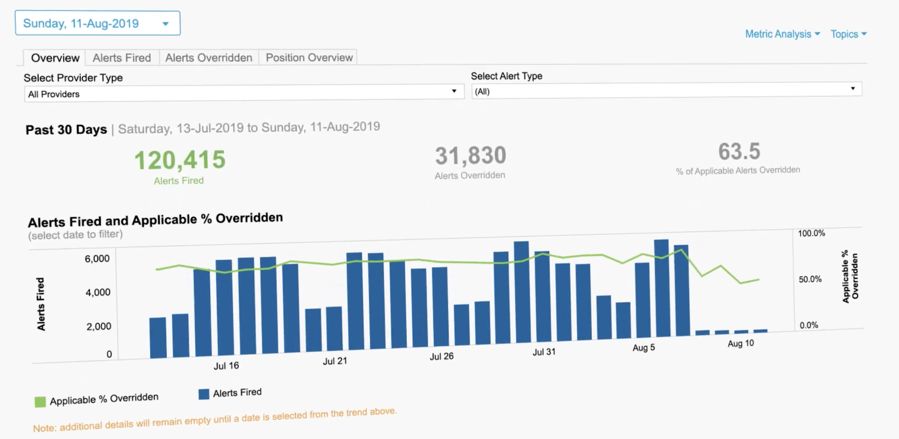
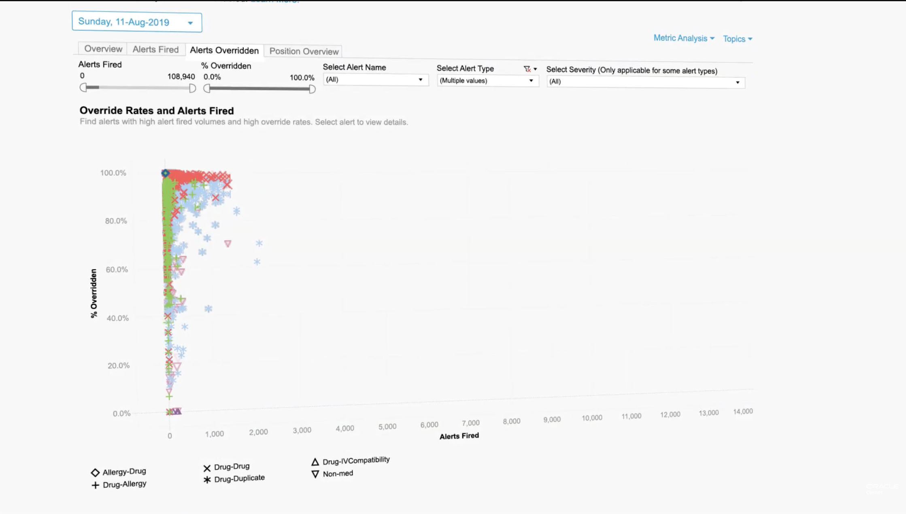
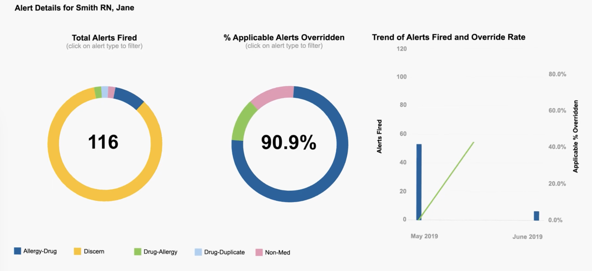
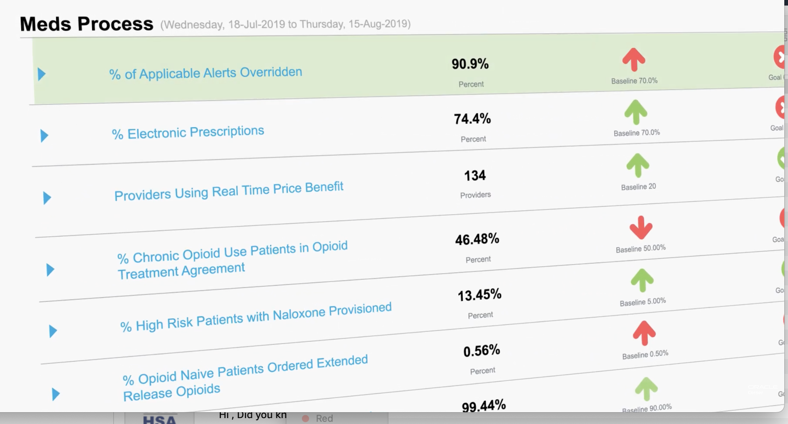

# Lights On Network (LON)
Overview of Oracle Cerner workflow analytics ("lights on network"),
with examples of dasbhards regarding staff interactions with alerts.  
Reference:  https://www.youtube.com/watch?v=7nk4xuriJAc

### Alerts Dashboard

### Alert Override Rates

### Alert Details

### Alerts by Provider

### Medication Processes

