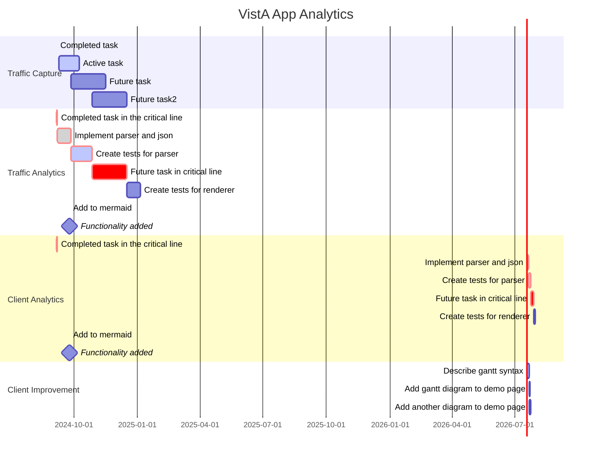

## Background
Each day across VA clinical staff use a suite of VistA Applications (Windows desktop applications) to create and process 50+ million new documents, orders, labs, images, reminders, and transactions in VistA. All VistA clients process their transactions remotely on VistA via remote procedure calls. In aggregate, these remote procedure calls (RPCs) between VistA clients and VistA describe all clinical care transactions and workflows performed at VHA medical centers.

    

#### VistA Application Analysis
The VistA Application Analysis team will analyze *all traffic* of *all VistA clients* of *all users* of three VistA systems. 
The Analysis Team shall also provide *inter-VistA traffic analysis*  distinguishing common VistA traffic patterns from VistA-specific traffic patterns.

Traffic Analysis for each VistA shall characterize:  
a)	User volume  
b)	Client types and volume of use  
c)	Connection volumes, frequency, and duration  
d)	Types of user authentication/security and relative use  
e)	Machine from end Users  
f)	RPC usage frequency and execution times  
g)	RPC groupings – representing transactions  
h)	RPCs specific to a VistA from cross-VistA RPCs  

Deliverables:  
A.	Traffic Analysis Reports for three production VistAs  
B.	Cross VistA Traffic Analysis Report

#### VistA Client Traffic Analysis
Based on the traffic and client types isolated in the VistA traffic analysis, the Analysis Team will analyze the operation of three of the most used VistA Applications ("Clients"). 
CPRS shall be one of the three; the remaining two shall be chosen based on client usage.  

The per Client Traffic Analysis will include:  
a)	User volumes and types. User types shall capture clinical care specialties and roles.  
b)	Connection volume and duration, tying frequency of client use to user types  
c)	Types of user authentication/security and relative use  
d)	Patient volumes  
e)	Enumeration of all RPCs used by a client and their relative use  
f)	Distinction of clinical from non-clinical RPCs  
g)	Distinction of RPCs that change (write) from those that read the clinical record  
h)	Distinction of slow running, high overhead and variable overhead RPCs  
i)	Clinical care task sets, represented as groups of RPCs used to perform specific clinical tasks  
j)	Match task sets with the use of one or more specific client screens  
k)	Task sets employed by different user types  (nursing, physician, and all identifiable specialties)
l)	Isolate performance issues with patterns of use that slow care  
m)	Verification and validation that the analysis accurately captures care provision  

## Use Cases
Below are real-world uses cases where VistA Application Analytics can provide detailed actionable information. 
(This list continues to expand over time)

__Efficiency__     
1. Cover sheet takes FOREVER to load (This drives me nuts, to the point that I do not load into this tab when selecting a new patient. Instead I load in on Notes tab and cringe when I need to tab over to Cover Sheet as I will face considerable lag).
2. When I am switching over from Visit Pending Notes to my GMC--Attending Note in CPRS, there are numerous episodes of lag associated with all the steps in doing this.
3. Certain large national TIU note templates lag, like TRVC consults.
4. The Alert When Results Feature is great to see targeted consult/test results, but there is so much lag with this feature before the results pop up...drives you nuts.
5. The Log in process for CPRS in general is really, really painful. (a)  When you first try to load it, you get no indication anything is happening, which leads you to believe you did not doube click the icon...if you do this again, then (b) eventually you will have 2 sessions loading, which you cannot back out of initially, drives you nuts.  Then, (c) when the PIV authentication happens, this is MINIMIZED in your screen backgrounds, so if you have 2 monitors with displays full (like email and TEAMS on each screen), when the PIV authentication happens, (d) you have no idea as it opens behind these screens.  If you fail to notice after enough time, (e) your login attempt is timed out.  Super annoying as there is a (f) big lag between trying to open CPRS and getting the PIV authentication screen,(g)  so you are held hostage...either do nothing and sit there twiddling your thumbs, or get to work and realize you may miss the window to find the authentication pop up

## Analytics Approach
To provide a modern, centralized cloud-based platform for veteran healthcare delivery, VA has migrated all VistA systems to the VA Enterprise Cloud, a federally certified commercial cloud managed by Amazon Web Services (AWS). By itsself, this migration ("lift-and-shift") of VistA to the AWS Cloud does not change VistA or any end-user functionality. However, VistA's new platform in the AWS Cloud provides over 200 new features and capabilities to VistA that can be used to improve veteran care quality, efficiency, and access. (See: [AWS Overview](https://docs.aws.amazon.com/whitepapers/latest/aws-overview/introduction.html))

    

By leveraging VistA's new AWS cloud-based traffic streaming capability, VHA has the first-ever opportunity to comprehensively analyze the clinical workflows of all staff at VA medical centers.  Such analysis would drive improved standards of practice by health care providers. These improvements would be prompted by the actual practice of care and not speculation about how care is being provided.

#### Workflow Capture
All VistA Application workflows (RPC traffic flows) of cloud-based VistA are streamed to cloud storage using the built-in traffic mirroring service in the AWS Cloud.

    

## Overview of Analysis
The Vista Application Analytics project will engage VistA data experts to analyze the RPC traffic between VistA clients and three representative Cloud VistA servers.   The analysis will be provided in a series of precise reports, detailing different aspect of VA care. Analysis will include the types and volumes of structured and unstructured information read and written by clearly identified classes of health care professional as well as the range of time spent on different tasks.  

On completion, VHA will possess a set of concrete, actionable recommendations, and demonstrations for improving the care provided to Veterans as well as a guide for how to perform such analysis in the future. 

#### Workflow Analytics
Using the RPC traffic captured, multiple parallel analyses will occur.
1. __Composite Analysis__: Simple and filtered analysis of *all* traffic from *all* users for *all*  applications of a specific VistA server. This provides *screen metrics* to be used in the VistA application-specific analysis.
2. __Sequence Analysis__: Identify and classify the longest common sequences (LCS) of RPCs generated by a given VistA Application. These LCS correspond to the *actual workflow* of end-users of a given VistA Application.
3. __Workflow Analysis__: The Vista Documentation Library (VDL) contains the User Guides for VistA Applications, which is the *documented workflow* of VistA Applications. The documentation and screenshots of specific VistA Applications are parsed and classified in a standardized computable form to permit analysis.
4. __Workflow Correlation Analysis__ - Correlate the (1) Actual screens generated by live users of a VistA Application (2) Documented screens based on the VDL descriptions for specific VistA Applications (3) Actual workflow - based on the LCS analyss of known RPCs an their fuction.

    

    

#### Analytics Methods

| analysis | storage | technique | summary |
|---------|----------|-----------|---------|
| Simple |  S3 | direct RPC queries | foundation metrics|
| Filtered | DynamoDB | RPC extraction scripts | RPC name, type, attributes |
| Sequence | RedshiftDB | RPC sequence reduction | longest common sequence (LCS) identification |
| Workflow | Github | VDL reduction | download -> parse, isolate, index -> flowchart (mermaid) |
| Correlation | Github | sequence comparison to workflow | Task Set identification |

### VistA Client traffic analysis

Using the client traffic captured, the Analysis Team will analyze all traffic of all VistA clients of all users of three VistA systems.  The Analysis Team shall also provide inter-VistA Analysis distinguishing common VistA traffic patterns from VistA-specific traffic patterns. 

Traffic Analysis Report for each VistA shall characterize:  
a)	User volume  
b)	Client types and volume of use  
c)	Connection volumes, frequency, and duration  
d)	Types of user authentication/security and relative use  
e)	Machine from end Users  
f)	RPC usage frequency and execution times  
g)	RPC groupings – representing transactions  
h)	RPCs specific to a VistA from cross-VistA RPCs  

Deliverables:  
A.	Traffic Analysis Reports for three production VistAs  
B.	Cross VistA Traffic Analysis Report

### Key VistA Client traffic analysis

Based on the traffic and client types isolated during the VistA traffic analysis, the Analysis Team shall produce a detailed Client Traffic Analysis of the operation of three of the most used VistA Applications ("Clients"). CPRS shall be one of the three; the remaining two shall be chosen based on client usage.   

All client analyses must be validated and verifiable in a demonstrable way, matching RPC flows to specific client screens and typical tasks. The Analysis Team shall document the verification and validation of the analysis and provide a Client Traffic Analysis Validation and Verification Report. 

The per Client Traffic Analysis shall include:  
a)	User volumes and types. User types shall capture clinical care specialties and roles.  
b)	Connection volume and duration, tying frequency of client use to user types  
c)	Types of user authentication/security and relative use  
d)	Patient volumes  
e)	Enumeration of all RPCs used by a client and their relative use  
f)	Distinction of clinical from non-clinical RPCs  
g)	Distinction of RPCs that change (write) from those that read the clinical record  
h)	Distinction of slow running, high overhead and variable overhead RPCs  
i)	Clinical care task sets, represented as groups of RPCs used in tandem  
j)	Match task sets with the use of one or more specific client screens  
k)	Task sets employed by different user types  
l)	Isolate performance issues with patterns of use that slow care  
m)	Verification and validation that the analysis accurately captures care provision  

Deliverables:  
A.	Three (3)  VistA Client Use Analysis Reports  
B.	Client Analysis Validation and Verification Report

Note: This task requires the Analysis Team to match the RPC traffic flows to client screens and tasks.  There is a unique RPC sequence associated with each task (login, logoff, ordering a medication, ordering a lab, writing notes, etc.). There will be thousands of unique RPC sequence - one for each interaction / task.   The Analysis Team must demonstrate that the matching of these RPC sequences to specific screens and tasks are complete and correct.

### VistA Client Use Improvement

Based solely on the Client Use Analysis Reports, the Analysis Team shall provide recommendations to upgrade the use of the top three RPC-using VistA Clients to deliver better clinical care. These recommendations shall be documented in Client Use Improvement Reports.

Deliverables:  
A.	Client Use Improvement Reports  

Note: This task requires the Analysis Team to provide recommendations to upgrade CPRS (and two other clients) to deliver better clinical care (more safe, more efficient, etc). These recommendations must come from soley the clinical workflow (RPC flows) analysis.

## Schedule

__Base Period__  
1. Capture of VistA client traffic  
2. Analysis of all VistA client traffic for three VistAs  
3. Analysis of Key VistA clients  
4. VistA client use improvement report

__Option Period__  
1. Migrated VistA client traffic analysis (VistA client traffic at EHRM sites)  
2. VistA Community Care client traffic analysis (JLV and others)

