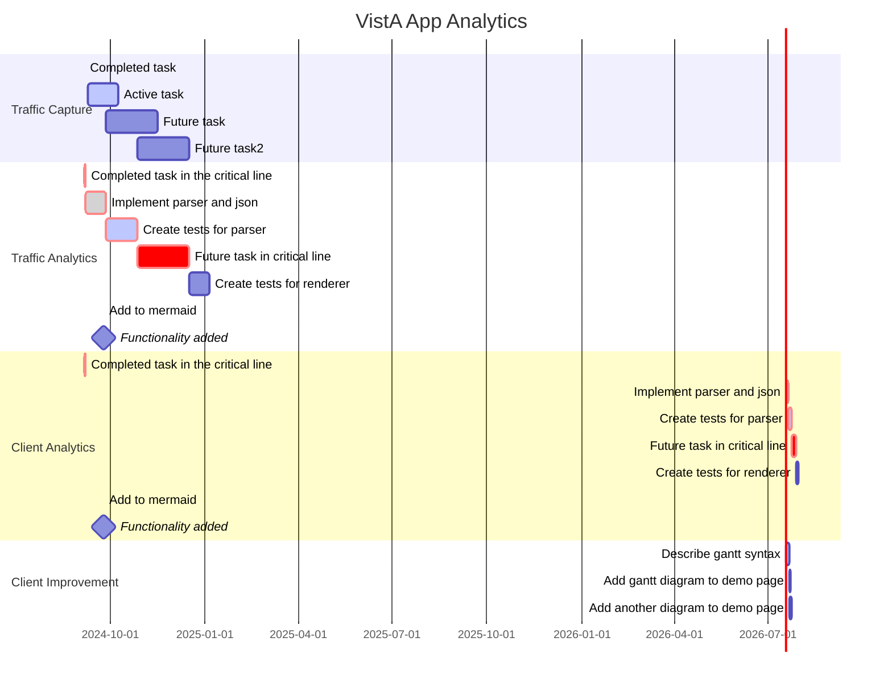

### Introduction
Each day across VA clinical staff use a suite of point-of-care applications ("VistA Applications") to create and process 50+ million documents, orders, labs, images, and transactions for veteran care. All VistA Applications process their transactions on VistA via remote procedure calls. In aggregate, these remote procedure calls (RPCs) between VistA Applications and VistA describe all clinical care transactions and workflows performed at VHA medical centers.

    

### Background
To provide a modern centralized platform for veteran healthcare delivery, VA has migrated all VistA systems from their many unique, legacy, decentralized environments across the country to a single, centralized, commercially-supported cloud platform managed by Amazon Web Services (AWS).  

This centralized cloud platform for VistA provides over two hundred new features, capabilities, and improvements for VistA that can be used to improve the quality, efficiency, and access of VA care for veterans. (See: [AWS Overview](https://docs.aws.amazon.com/whitepapers/latest/aws-overview/introduction.html))  

    

By leveraging the traffic streaming capability of cloud-based VistA, VHA has the first-ever opportunity to comprehensively analyze the actual workflows of all clinical staff at VA medical centers.  Such analysis would drive improved standards of practice by health care providers. These improvements would be prompted by the actual practice of care and not speculation about how care is being provided.

### Overview of Analysis
The Vista Application Analytics project will capture and analyze all end-user traffic between all VistA clients (VistA Applications) and cloud-based VistA.  This analysis will provide precise reports detailing different aspect of VA care. Analysis will include the types and volumes of structured and unstructured information read and written by clearly identified types of healthcare providers and the range of time spent on different tasks. On completion, VHA will possess a set of concrete, actionable recommendations;  demonstrations for improving  veteran care workflows and efficiency; and a comprehensie guide to perform such analyses in the future.

#### Workflow Capture
All VistA client workflows (RPC traffic flows) of cloud-based VistA are streamed to cloud storage using the built-in traffic mirroring service in the AWS Cloud.

    

#### Workflow Analysis

    

## Schedule

__Year 1__  
1. Capture of VistA client traffic  
2. Analysis of all VistA client traffic for three VistAs  
3. Analysis of Key VistA clients  
4. VistA client use improvement report

__Year 2__  
1. Transition VistA client traffic analysis (VistA client traffic at EHRM sites)  
2. Community Care client traffic analysis (VistA client traffic for Community Care clients)

### References
[VHA Workforce Dashboard 2023](https://www.va.gov/EMPLOYEE/docs/workforce/VA-Workforce-Dashboard-Issue-03.pdf)

