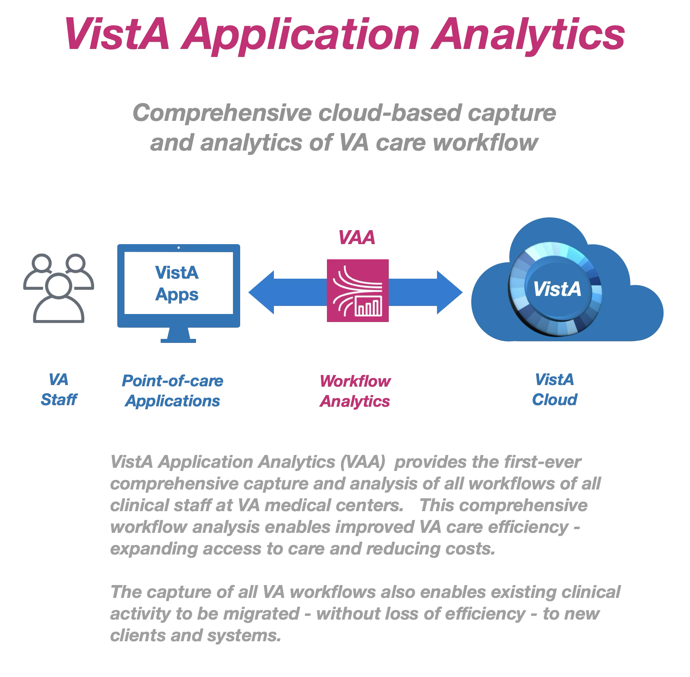
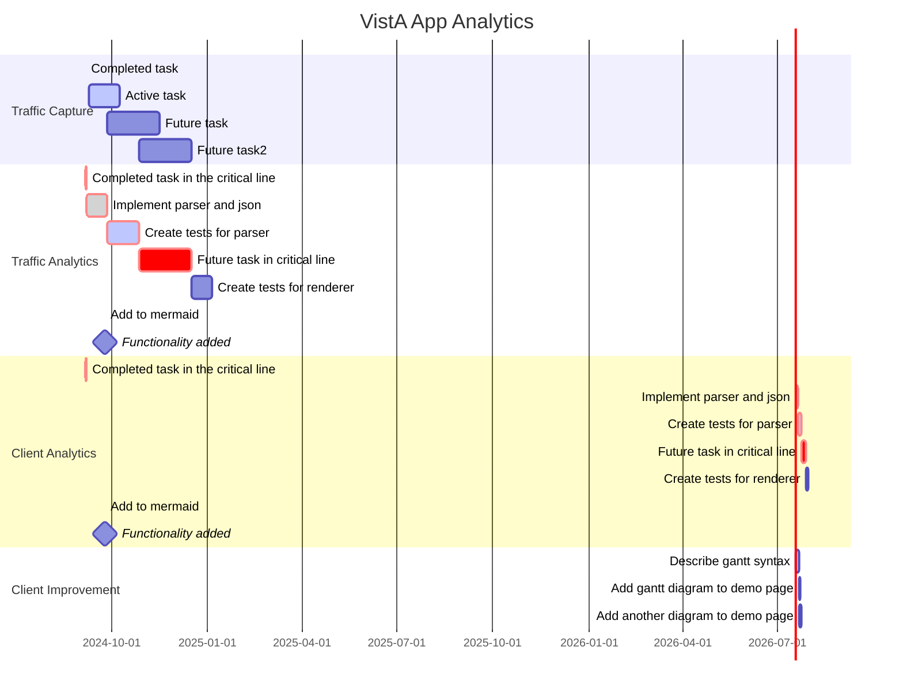

### Introduction
Each day across VA clinical staff use a suite of point-of-care applications ("VistA Applications") to create and process 50+ million documents, orders, labs, images, and transactions for veteran care. All VistA Applications process their transactions on VistA via remote procedure calls. In aggregate, these remote procedure calls (RPCs) between VistA Applications and VistA describe all clinical care transactions and workflows performed at VHA medical centers.

    

### Background
To provide a modern, centralized cloud-based platform for veteran healthcare delivery, VA has migrated all VistA systems to the VA Enterprise Cloud, a federally certified commercial cloud managed by Amazon Web Services (AWS).  

This new AWS Cloud platform for VistA provides over two hundred new features, capabilities, and improvements for VistA that can be used to improve the quality, efficiency, and access of VA care for veterans. (See: [AWS Overview](https://docs.aws.amazon.com/whitepapers/latest/aws-overview/introduction.html))  

    

By leveraging VistA's new AWS cloud-based traffic streaming capability, for example, VHA has the first-ever opportunity to comprehensively analyze the clinical workflows of all staff at VA medical centers.  Such analysis would drive improved standards of practice by health care providers. These improvements would be prompted by the actual practice of care and not speculation about how care is being provided.

### Overview of Analysis
The Vista Application Analytics team will capture and analyze all end-user traffic between all VistA clients (VistA Applications) and three representative VistA servers.  This analysis will provide precise reports detailing different aspect of VA care. Analysis will include the types and volumes of structured and unstructured information read and written by clearly identified types of healthcare providers and the range of time spent on different tasks. On completion, VHA will possess a set of concrete, actionable recommendations;  demonstrations for improving  veteran care workflows and efficiency; and a comprehensie guide to perform such analyses in the future.

#### Workflow Capture
All VistA client workflows (RPC traffic flows) of cloud-based VistA are streamed to cloud storage using the built-in traffic mirroring service in the AWS Cloud.

    

#### Workflow Correlation Analysis

    

## Schedule

__Base Period__  
1. Capture of VistA client traffic  
2. Analysis of all VistA client traffic for three VistAs  
3. Analysis of Key VistA clients  
4. VistA client use improvement report

__Option Period__  
1. Migrated VistA client traffic analysis (VistA client traffic at EHRM sites)  
2. VistA Community Care client traffic analysis (VistA client traffic for JLV and others)

#### VistA Client Traffic Analysis
The VAA team will analyze *all traffic* of *all users* of *all VistA clients* for three VistA systems. 

The Analysis Team will also provide *inter-VistA traffic analysis*, distinguishing common (enterprise standardized) VistA traffic patterns from local, site-specific VistA traffic patterns.

Traffic Analysis for each VistA will characterize:  
a)	User volume  
b)	Client types and volume of use  
c)	Connection volumes, frequency, and duration  
d)	Types of user authentication/security and relative use  
e)	Machine from end User   
f)	RPC usage frequency and execution times  
g)	RPC groupings – representing transactions  
h)	RPCs specific to a VistA from cross-VistA RPCs  

Deliverables:  
A.	Traffic Analysis Reports for three production VistAs  
B.	Cross VistA Traffic Analysis Report

#### Key VistA Client Traffic Analysis
Based on the traffic and client types isolated in the VistA traffic analysis, the VAA team will analyze the operation of three of the most used VistA Applications ("Clients").  CPRS shall be one of the three; the remaining two shall be chosen based on client usage.  

The Client-specific Traffic Analysis will include:  
a)	User volumes and types. User types shall capture clinical care specialties and roles.  
b)	Connection volume and duration, tying frequency of client use to user types  
c)	Types of user authentication/security and relative use  
d)	Patient volumes  
e)	Enumeration of all RPCs used by a client and their relative use  
f)	Distinction of clinical from non-clinical RPCs  
g)	Distinction of RPCs that change (write) from those that read the clinical record  
h)	Distinction of slow running, high overhead and variable overhead RPCs  
i)	Clinical care task sets, represented as groups of RPCs used to perform specific clinical tasks  
j)	Match task sets with the use of one or more specific client screens  
k)	Task sets employed by different user types  (nursing, physician, and all identifiable specialties)
l)	Isolate performance issues with patterns of use that slow care  
m)	Verification and validation that the analysis accurately captures care provision  

#### VistA Client Use Improvement

Based solely on the Client Use Analysis Reports, the Analysis Team shall provide recommendations to upgrade the use of the top three RPC-using VistA Clients to deliver better clinical care. These recommendations shall be documented in Client Use Improvement Reports.

Deliverables:  
A.	Client Use Improvement Reports  

### Other Use Cases
VistA Application Analytics can provide actionable insight a wide range of other VHA clinical workflows, including the following:

__Efficiency__     
Identify and minimize the process and latency of key workflows of CPRS, such as:
1. Login process and time 
2. Cover sheet load time
3. Note template load time: Large/complex note templates (TRVC consults, etc)
4. Real-tiime alert optimization: Improve real-time alerting when results are available from lab or other domains

__Transition planning__
1. Identify all users and usage of VHA clinical systems at VAMCs planned for transition
2. Identify all applications in use at VAMCs planned for transition

### References
[VHA Workforce Dashboard 2023](https://www.va.gov/EMPLOYEE/docs/workforce/VA-Workforce-Dashboard-Issue-03.pdf)

