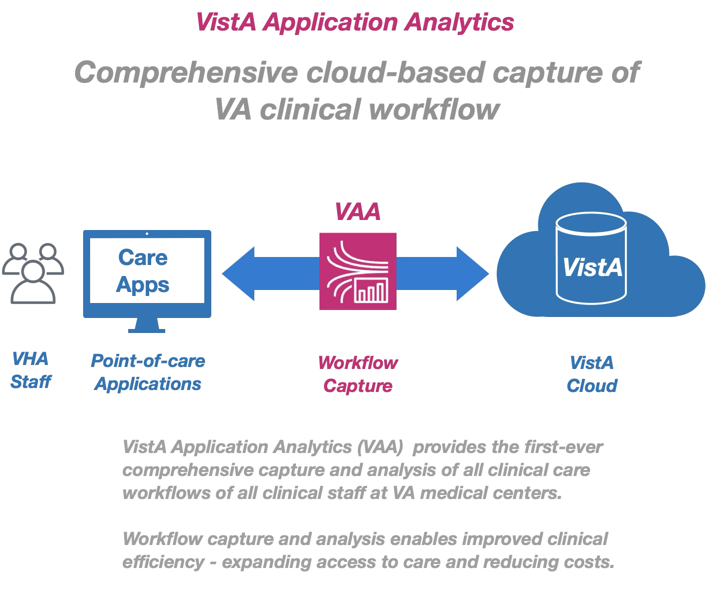

### Summary
By leveraging the traffic streaming capability of cloud-based VistA, VHA has the first-ever opportunity to comprehensively analyze the actual workflows of all clinical staff at VA medical centers.  Such analysis would drive improved standards of practice by health care providers. These improvements would be prompted by the actual practice of care and not speculation about how care is being provided.

* Understanding of VA'a current workflows is key for better operations and migration to new systems.
* VAA enables comprehensive understanding VA workflows, analyzed by categorizing and sequencing the transactional traffic flows that clinical care applications generate.
* Not all workflows are equal. What is most used? What quick orders or note templates truly matter? All this information is contained in the traffic flows of Vista Clients.

### Introduction
Each day across VA clinical staff use a suite of VistA point-of-care applications (CPRS and 40+ others) to create and process over 50 million documents, orders, labs, images, and transactions for veteran care. All VistA Applications process their transactions on VistA via remote procedure calls. In aggregate, these remote procedure calls (RPCs) between VistA Applications and VistA describe all clinical care transactions and workflows performed at VHA medical centers.

    

### Background
To provide a modern platform for veteran healthcare delivery, VA has migrated all VistA systems from their many unique, legacy, decentralized environments across the country to a single, centralized, commercially-supported cloud platform managed by Amazon Web Services (AWS).  

This centralized cloud platform for VistA provides over two hundred new features, capabilities, and improvements for VistA that can be used to improve the quality, efficiency, and access of VA care for veterans. (See: [AWS Overview](https://docs.aws.amazon.com/whitepapers/latest/aws-overview/introduction.html))  

    

By leveraging the traffic streaming capability of cloud-based VistA, VHA has the first-ever opportunity to comprehensively analyze the actual workflows of all clinical staff at VA medical centers.  Such analysis would drive improved standards of practice by health care providers. These improvements would be prompted by the actual practice of care and not speculation about how care is being provided.

### Overview of Analysis
The Vista Application Analytics project will capture and analyze all end-user traffic between all VistA clients (VistA Applications) and cloud-based VistA.  This analysis will provide precise reports detailing different aspect of VA care. Analysis will include the types and volumes of structured and unstructured information read and written by clearly identified types of healthcare providers and the range of time spent on different tasks. On completion, VHA will possess a set of concrete, actionable recommendations;  demonstrations for improving  veteran care workflows and efficiency; and a comprehensie guide to perform such analyses in the future.

#### Workflow Capture
All VistA client workflows (RPC traffic flows) of cloud-based VistA are streamed to cloud storage using the built-in traffic mirroring service in the AWS Cloud.

    

#### Workflow Analysis
Workflow analysis is comprised of sequential levels of increasingly nuanced analysis, each of which builds on the other:  
A. __Metrics Analysis (Statistical Analysis)__: Raw unprocessed RPC traffic is quality controlled for completeness and correctness. RPCs are identified by volume, type, use, and client

B. __Workflow Correlation Analysis (Semantic Analysis)__: Correlate the RPC sequences to each client screen and the associated user interactions (i.e. what the doctor sees and does on the screen is correlated to the RPC sequences that this generates).  This correlation is built on four parallel analyses:  
1. __Usage Analysis__: Variety of specific RPCs used by specific VistA clients (Example: 850+ distinct RPCs used by CPRS)  
2. __Sequence Analysis__: Identify the longest common sequence of RPCs behind each transaction (Eample: RPC sequence for updating an allergy)
3. __Screen Analysis__: Identify the client screens specific to each workflow (Example: screens the user sees when updating an allergy)
4. __Document Analysis__:  Identify the user documentation specific to each workflow (Example: user guide for updating an allergy)

    

## Schedule

__Year 1: Foundational Workflow Analysis__  
1. Capture of all VistA client traffic  
2. Metrics Analysis
3. Workflow Correlation Analysis
  i. Usage Analysis  
  ii. Sequence Analysis  
  iii. Screen Analysis  
  iv. Document Analysis
4. VistA client use improvement report - based on *actual* workflow

__Year 2: Key Client Workflow Analyses__  
1. Transition workflow analysis (VistA client traffic at an EHRM site)  
2. Community Care workflow analysis (VistA client traffic for Community Care)

