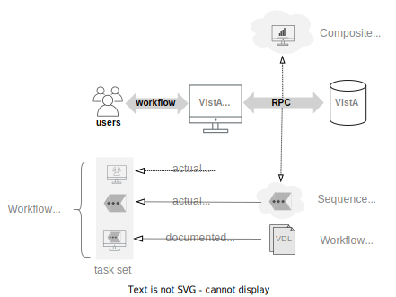

### Introduction
To provide a modern, centralized cloud-based platform for veteran healthcare, VA has migrated all VistA systems to the VA Enterprise Cloud, a federally certified commercial cloud managed by Amazon Web Services. VA's new centralized cloud-based VistA ("Cloud VistA") provides many new features and capabilities to VistA and veteran care.

By leveraging built-in traffic streaming capabilities of cloud-based VistA, VHA has the first-ever opportunity to comprehensively analyze the clinical workflows of all staff at VA medical centers.  Such analysis would drive improved standards of practice by health care providers. These improvements would be prompted by the actual practice of care and not speculation about how care is being provided.

Today Veteran care is provided by VHA Staff using a suite of VistA applications (windows desktop applications), which process all their transactions on VistA via remote procedure calls (RPCs). In aggregate, these remote procedure calls between VistA applications (clients) and VistA (server) encapsulate and describe all clinical care transactions and workflowss performed at a VHA medical center.

The Vista Application Analytics project calls for health care data experts to analyze the RPC traffic between VistA clients and three representative VistA servers. The analysis will be provided in a series of precise reports, detailing different aspect of VA care.  Analysis will include the types and volumes of structured and unstructured information read and written by clearly identified classes of health care professional as well as the range of time spent on different tasks.  On completion, VHA will possess a set of concrete, actionable recommendations, and demonstrations for improving the care provided to Veterans as well as a guide for how to perform such analysis in the future.


#### Workflow Capture
All of the VistA Application workflows (RPC traffic) of cloud-based VistA will be streamed to a simple storage service (S3) using the built-in traffic mirroring service in the AWS cloud.


#### Workflow Analytics


#### Workflow Correlation


#### Analytics Methods

| analysis | storage | technique | summary |
|---------|----------|-----------|---------|
| Simple |  S3 | direct RPC queries | foundation metrics|
| Filtered | DynamoDB | RPC extraction scripts | RPC name, type, attributes |
| Sequence | RedshiftDB | RPC sequence reduction | longest common sequence (LCS) identification |
| Workflow | Github | VDL reduction | download -> parse, isolate, index -> flowchart (mermaid) |
| Correlation | Github | sequence comparison to workflow | Task Set identification |


#### Schedule

```text
BASE PERIOD
1.	CAPTURE OF VISTA CLIENT TRAFFIC	
2.	ANALYSIS OF VISTA CLIENT TRAFFIC
3.	ANALYSIS OF USE OF KEY VISTA CLIENTS
4.	VISTA CLIENT USE IMPROVEMENT REPORT
OPTION PERIOD
1.	MIGRATED VISTA CLIENT TRAFFIC ANALYSIS
2.	VISTA COMMUNITY CARE CLIENT TRAFFIC ANALYSIS
```


### Capture of VistA Client Traffic

The Contractor shall coordinate the use of built-in VAEC facilities to non-invasively log the VistA client traffic (RPC traffic) of VAEC-hosted VistAs for a representative period. As a non-invasive method, it will not require any change, reconfiguration, interfaces, development, patches, or plugins in the VistA system itself or any client communicating with that VistA. 

The Contractor shall coordinate the logging of all client traffic of three VAEC-based production VA VistAs (“Analyzed VistAs”). At least one of the VistAs should support a large integrated medical facility.  
   
The Contractor shall:  
a)	In collaboration with the Government, identity three VistAs and obtain permission from their managers to capture their RPC traffic  
b)	Coordinate the configuration of the RPC Traffic capture to log all RPC traffic for these three VistAs.  
c)	Monitor and ensure traffic logging of each of the three identified VistAs for at least one month and the storage of all captured data in VAEC for analysis.  
d)	Develop and provide a VistA Traffic Logging Standard Operating Procedure to document the processes and procedures used to log required traffic from any VistA, including permissions required from VistA owners and VAEC maintainers

Deliverables:  
A.  VistA Traffic Logging Standard Operating  Procedure  

=> This task requires the vendor to use facilities built into the VA Enterprise Cloud (i.e. features already built in to AWS)  to non-invasively capture RPC traffic. 


### Analysis of VistA Client Traffic

Using the client traffic captured (deliverable 5.2.1A) , the Contractor shall provide Traffic Analysis Reports comprising the complete client traffic for each of the three analyzed VistAs. In addition, the Contractor shall provide a Cross VistA Analysis Report distinguishing cross-VistA from VistA-specific traffic patterns. All four reports (i.e. 3 Traffic Analysis Reports and 1 Cross VistA Analysis Report) shall be composed in GitHub compatible markdown with embedded graphics where appropriate. The Contractor shall store all four reports as markdown in the VA Enterprise GitHub. 

Traffic Analysis Report for each VistA shall characterize:  
a)	User volume  
b)	Client types and volume of use  
c)	Connection volumes, frequency, and duration  
d)	Types of user authentication/security and relative use  
e)	Machine from end Users  
f)	RPC usage frequency and execution times  
g)	RPC groupings – representing transactions  
h)	RPCs specific to a VistA from cross-VistA RPCs  

DELIVERABLES:  
A.	Traffic Analysis Reports for three production VistAs  
B.	Cross VistA Traffic Analysis Report


=> This task requires the contractor to provide summary statistics and totals for volumes and varieties of client traffic of three VistAs.


### Analysis of Use of Key VistA Clients

Based on the traffic and client types isolated during the VistA traffic analysis, the Contractor shall produce a detailed Client Traffic Analysis of the operation of three of the most used VistA point-of-care applications ("Clients"). CPRS shall be one of the three; the remaining two shall be chosen after project start based on client usage. All three reports shall be composed in GitHub compatible markdown with embedded graphics where appropriate.  The Contractor shall store the three reports in a git in the VA Enterprise GitHub.   All client analyses must be validated and verifiable in a demonstrable way, matching RPC flows to specific client screens and typical tasks. The Contractor shall document the verification and validation of the analysis and provide a Client Traffic Analysis Validation and Verification Report. 

The per Client Traffic Analysis shall include:  
a)	User volumes and types. User types shall capture clinical care specialties and roles.  
b)	Connection volume and duration, tying frequency of client use to user types  
c)	Types of user authentication/security and relative use  
d)	Patient volumes  
e)	Enumeration of all RPCs used by a client and their relative use  
f)	Distinction of clinical from non-clinical RPCs  
g)	Distinction of RPCs that change (write) from those that read the clinical record  
h)	Distinction of slow running, high overhead and variable overhead RPCs  
i)	Clinical care task sets, represented as groups of RPCs used in tandem  
j)	Match task sets with the use of one or more specific client screens  
k)	Task sets employed by different user types  
l)	Isolate performance issues with patterns of use that slow care  
m)	Verification and validation that the analysis accurately captures care provision  

Deliverables:  
A.	Three (3)  VistA Client Use Analysis Reports  
B.	Client Analysis Validation and Verification Report


=> This task requires the contractor to match the RPC traffic flows to client screens and tasks.  There will be a unique RPC flow associated with each task (login, logoff, ordering a medication, ordering a lab, writing notes, etc.). There will be hundreds of unique RPC flows - one for each interaction / task.   The contractor must explain HOW they will do this matching of RPC flows to client screens user tasks.  The contractor must also demonstrate that the matching of these RPC flows to specific screens and tasks are complete and correct.


### VistA Client Use Improvement

Based solely   on the Client Use Analysis Reports, the Contractor shall provide recommendations to upgrade the use of the top three RPC-using Point-of-Care VistA Clients to deliver better clinical care. These recommendations shall be documented in Client Use Improvement Reports for each Client in Microsoft Word and a supporting PowerPoint presentation. 

Deliverables:  
A.	Client Use Improvement Reports  


=> This task requires the contractor to provide recommendations to upgrade CPRS (and two other clients) to deliver better clinical care (more safe, more efficient, etc). These recommendations must come from soley the clinical workflow (RPC flows) analysis of section 5.2.3.
