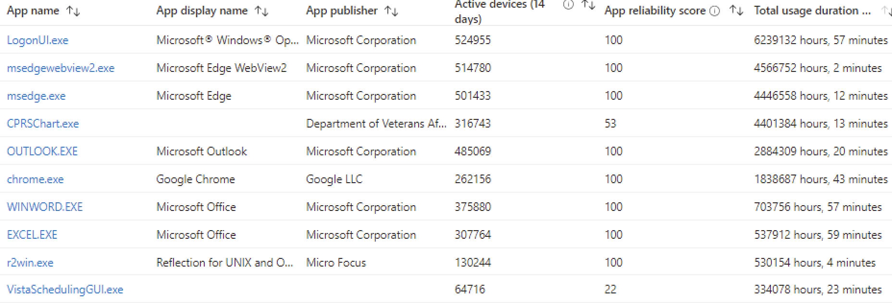

## VA End-User Application Monitoring
VA uses a cloud-based tool called Microsoft Intune to monitor 
and analyze the reliability and performance of all Windows 
desktop applications across all of VA's 500,000+ distinct 
computers. See: [VA Application Dashboard](https://intune.microsoft.com/#view/Microsoft_Intune_Enrollment/UXAnalyticsMenu/~/applicationReliability)

### Summary
* CPRS is the most used application in VA -  even more than *all* Microsoft Office products *combined*.
* In a given two-week monitoring  period, VA staff use CPRS more than 4.4 million hours (4,401,384 hours)

#### VA End-User Application Usage Dashboard

#### VA End-User Application Usage: Top 10

| App name | App display name| Active Devices | Total usage duration (14 days)|
| --- | --- | --- | --- | 
| CPRSChart.exe | __CPRS Chart__ | 316,743 | 4,401,384 hr |
| OUTLOOOK.exe | Microsoft Outlook (email) | 485,069 | 2,884,309 hr|
| chrome.exe | Google Chrome  (browser)| 262,156 | 1,838,687 hr |
| WINWORD.exe | Microsoft Word | 375,880 | 703,756 hr|
| EXCEL.exe | Microsoft Excel | 307,764 | 537,912 |

