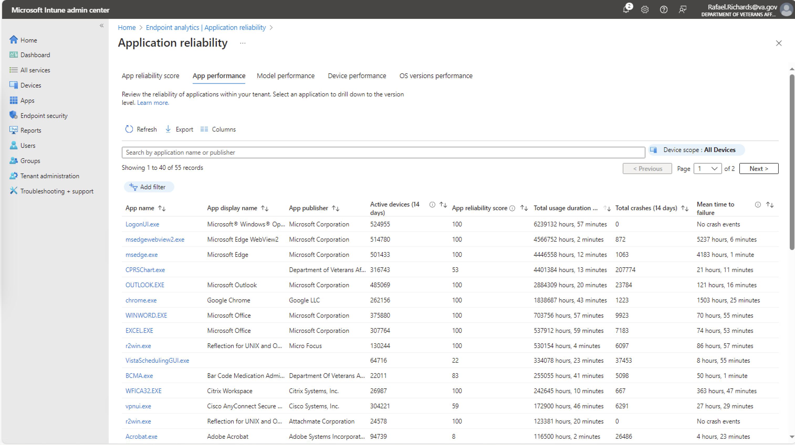

## VA End-User Application Monitoring
VA uses a commercial cloud-based tool called Microsoft Intune to monitor
and analyze the reliability and performance of all Windows desktop
applications across all of VA's 450,000+ computers.

#### Microsoft Intune dashboard
https://intune.microsoft.com/#view/Microsoft_Intune_Enrollment/UXAnalyticsMenu/~/applicationReliability

#### VA End-User Application Usage Dashboard
The VA Application Dashboard shows high-use end-user applications sorted by usage.

